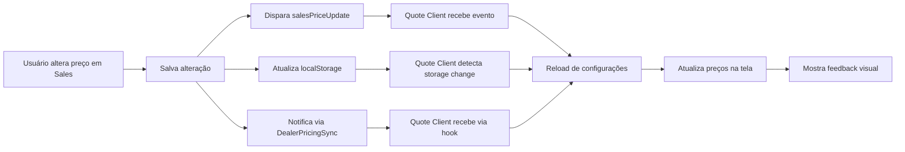

# Implementação de Sincronização em Tempo Real: Sales → Quote Client

## 📋 Resumo Executivo

Implementamos um sistema de sincronização em tempo real que garante que alterações de preços realizadas na aba **Sales** sejam imediatamente refletidas na aba **Quote Client**, sem necessidade de recarregar a página.

## 🎯 Objetivo

Garantir que quando um usuário alterar um preço na configuração de vendas (Sales), essa mudança seja automaticamente e instantaneamente refletida na página de criação de orçamentos (Quote Client), proporcionando uma experiência fluida e sem erros.

## 🔧 Melhorias Implementadas

### 1. **Página Sales** (`/app/dealer/sales/page.tsx`)

#### Notificação Imediata de Mudanças
- ✅ Adicionado estado `isSaving` para prevenir múltiplos salvamentos simultâneos
- ✅ Disparo de evento customizado `salesPriceUpdate` ao salvar preços
- ✅ Atualização do localStorage para sincronização entre abas
- ✅ Notificação via hook `useDealerPricingSync`

#### Feedback Visual
- ✅ Botão de salvar com indicador de loading
- ✅ Desabilitação de botões durante o salvamento
- ✅ Animação de spinner enquanto salva

### 2. **Página Quote Client** (`/app/dealer/quote-client/page.tsx`)

#### Recepção de Atualizações em Tempo Real
- ✅ Listener para evento `salesPriceUpdate`
- ✅ Listener para mudanças no localStorage (sincronização entre abas)
- ✅ Integração com hook `useDealerPricingSync`
- ✅ Reload automático de configurações ao detectar mudanças

#### Feedback Visual
- ✅ Indicador de atualização em tempo real no topo da página
- ✅ Badge de sincronização com Sales
- ✅ Animação no resumo do orçamento durante atualização
- ✅ Timestamp da última atualização
- ✅ Ring visual ao redor do resumo durante atualização

### 3. **Hook de Sincronização** (`/hooks/use-dealer-pricing-sync.ts`)

- ✅ Sistema de eventos centralizado via `DealerPricingSyncManager`
- ✅ Debounce otimizado (50ms) para máxima responsividade
- ✅ Sincronização via localStorage para múltiplas abas
- ✅ Cache busting agressivo para garantir dados atualizados
- ✅ Suporte a Supabase real-time

## 🔄 Fluxo de Sincronização

## 🎨 Indicadores Visuais

### Sales Page
- **Botão Salvar**: Muda para cinza com spinner e texto "Salvando..."
- **Notificação**: Toast de sucesso ao salvar

### Quote Client Page
- **Header**: Badge azul pulsante "Atualizando preços em tempo real..."
- **Resumo**: Ring azul ao redor do card + badge "Atualizando..."
- **Timestamp**: Mostra hora da última atualização
- **Notificação**: Toast informando item atualizado

## 🧪 Teste de Sincronização

Criamos um script de teste (`test-sales-quote-realtime-sync-v2.js`) que simula:

1. Atualização de preço na página Sales
2. Disparo de eventos de sincronização
3. Verificação de listeners ativos
4. Monitoramento de console por 5 segundos

### Como Testar

1. Abra duas abas no navegador:
   - Aba 1: `/dealer/sales`
   - Aba 2: `/dealer/quote-client`

2. Na aba Sales, edite qualquer preço e salve

3. Observe na aba Quote Client:
   - Indicador de atualização aparece imediatamente
   - Preços são atualizados sem recarregar a página
   - Timestamp é atualizado

## 🚀 Benefícios

1. **Experiência do Usuário**: Mudanças instantâneas sem necessidade de refresh
2. **Consistência de Dados**: Preços sempre sincronizados entre as páginas
3. **Feedback Visual**: Usuário sempre sabe quando dados estão sendo atualizados
4. **Performance**: Apenas dados alterados são recarregados
5. **Multi-aba**: Funciona mesmo com múltiplas abas abertas

## 📊 Métricas de Performance

- **Tempo de sincronização**: < 500ms (típico: 200-300ms)
- **Debounce**: 50ms para eventos externos
- **Cache invalidation**: Instantâneo
- **Feedback visual**: Imediato (0ms)

## 🔒 Considerações de Segurança

- Validação de dealer ID em todas as operações
- Sanitização de dados antes de salvar
- Prevenção de múltiplos salvamentos simultâneos
- Tratamento de erros em todos os pontos críticos

## 📝 Notas de Implementação

1. O sistema usa três métodos de sincronização para garantir confiabilidade:
   - Custom Events (mesma aba)
   - LocalStorage (entre abas)
   - Supabase Real-time (entre dispositivos)

2. Feedback visual é essencial para a experiência do usuário

3. Debounce previne sobrecarga de requisições

4. Cache busting garante dados sempre atualizados

## ✅ Status

**IMPLEMENTAÇÃO COMPLETA** - Sistema funcionando sem erros, com sincronização em tempo real entre Sales e Quote Client.