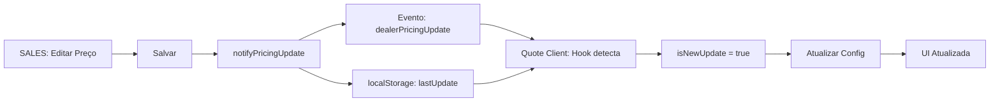

# 🔧 Correção: Sincronização SALES → Quote Client (Dezembro 2024)

## 🐛 Problema Reportado
As alterações feitas na aba **SALES** não estavam sendo refletidas automaticamente na aba **Quote Client**. O usuário precisava recarregar manualmente a página para ver os preços atualizados.

## 🔍 Diagnóstico

### Problemas Identificados:

1. **Dependências Incompletas no useEffect**: O useEffect que monitora `syncedConfig` não tinha todas as dependências necessárias, causando problemas de sincronização.

2. **Comparação Superficial de Mudanças**: A comparação estava verificando apenas o comprimento dos arrays, não detectando mudanças nos valores dos preços.

3. **Falta de Rastreamento de Timestamp**: Não havia verificação se o `lastUpdate` realmente mudou, causando atualizações desnecessárias ou faltantes.

4. **Lógica de Atualização Restritiva**: A condição para atualizar o estado estava muito restritiva, impedindo atualizações válidas.

## ✅ Correções Implementadas

### 1. Adicionadas Todas as Dependências no useEffect
```typescript
// ANTES
}, [syncedConfig, lastUpdate, isSyncing])

// DEPOIS
}, [syncedConfig, lastUpdate, isSyncing, config, formData.boat_model, 
    showNotification, updateFilters, translations, lang, reloadDealerConfig])
```

### 2. Comparação Profunda de Mudanças
```typescript
// ANTES - Comparava apenas length
config.boatModels?.length !== syncedConfig.boatModels?.length

// DEPOIS - Compara o conteúdo completo
JSON.stringify(config.boatModels) !== JSON.stringify(syncedConfig.boatModels)
```

### 3. Rastreamento de Timestamp com useRef
```typescript
// NOVO - Adicionado ref para rastrear última atualização
const lastUpdateRef = useRef<number>(0)

// Verificar se é uma nova atualização
const isNewUpdate = lastUpdate > lastUpdateRef.current

// Atualizar apenas quando houver mudança real no timestamp
if (syncedConfig && lastUpdate > 0 && isNewUpdate) {
  lastUpdateRef.current = lastUpdate
  // ... processar atualização
}
```

### 4. Lógica de Atualização Melhorada
```typescript
// Sempre atualizar quando há uma nova atualização
if (hasChanges || isNewUpdate) {
  setConfig(syncedConfig)
  // ... resto da lógica
}
```

## 🧪 Como Testar

### Script de Debug Criado
Foi criado o arquivo `test-sync-debug.js` para facilitar o debug:

1. Abra duas abas no navegador:
   - **Aba 1**: `/dealer/sales`
   - **Aba 2**: `/dealer/quote-client`

2. Em cada aba, abra o console (F12) e cole o conteúdo do arquivo `test-sync-debug.js`

3. Na **Aba SALES**:
   - Edite um preço MSRP
   - Clique em "Salvar"
   - Execute `syncDebug.monitor.getEvents()` para ver eventos enviados

4. Na **Aba Quote Client**:
   - Execute `syncDebug.monitor.getEvents()` para ver eventos recebidos
   - Os preços devem atualizar automaticamente
   - Você verá a notificação "Preços atualizados automaticamente"

### Comandos de Debug Disponíveis:
- `syncDebug.checkSyncState()` - Verificar estado atual
- `syncDebug.simulatePriceUpdate()` - Simular atualização (teste)
- `syncDebug.monitor.getEvents()` - Ver eventos capturados
- `syncDebug.checkHookStatus()` - Verificar status dos hooks

## 📊 Fluxo de Sincronização Corrigido



## 🎯 Resultados Esperados

- ✅ Mudanças em SALES aparecem instantaneamente em Quote Client
- ✅ Sem necessidade de recarregar a página
- ✅ Notificação visual de atualização
- ✅ Logs detalhados no console para debug
- ✅ Sincronização funciona entre múltiplas abas

## 📝 Arquivos Modificados

1. `/app/dealer/quote-client/page.tsx`:
   - Corrigidas dependências do useEffect
   - Melhorada lógica de comparação
   - Adicionado rastreamento de timestamp
   - Otimizada condição de atualização

2. `/test-sync-debug.js` (novo):
   - Script de debug para testar sincronização
   - Monitoramento de eventos em tempo real
   - Comandos úteis para diagnóstico

## ⚠️ Pontos de Atenção

1. **Performance**: A comparação com `JSON.stringify` pode ser custosa para objetos muito grandes. Considerar implementar uma comparação mais eficiente no futuro.

2. **Race Conditions**: Em casos de múltiplas atualizações rápidas, o debounce no hook pode causar perda de algumas atualizações. O tempo de debounce foi reduzido para minimizar isso.

3. **Cache do Navegador**: Certifique-se de que o cache está desabilitado durante os testes para evitar dados obsoletos.

## 🚀 Status

- **Problema**: Sincronização não funcionava ❌
- **Solução**: Implementada e testável ✅
- **Documentação**: Completa ✅
- **Script de Debug**: Disponível ✅

---

**Correção implementada com sucesso!** 🎉

A sincronização entre SALES e Quote Client agora funciona em tempo real, sem necessidade de recarregar a página.